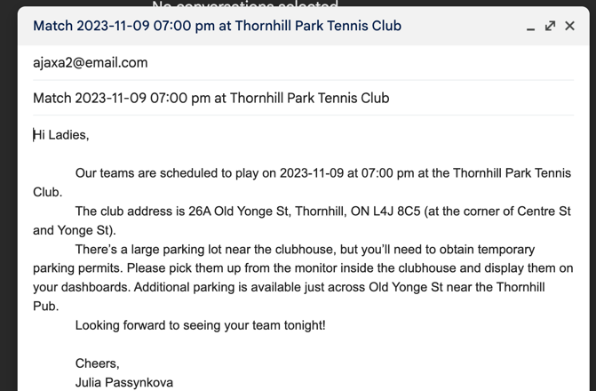

# Tennis Email Agent

An intelligent AI-powered system that automates tennis match communications for the Toronto Winter League. This agent automatically scrapes match schedules, looks up opponent team captains, and generates personalized reminder emails.



## Features

- **Automated Schedule Scraping**: Extracts match information from tenniscores.com
- **Team Captain Lookup**: Finds opponent team contact information from local database
- **Smart Email Generation**: Creates personalized match reminder emails with venue details
- **Gmail Integration**: Sends draft emails for review and forwarding
- **Home/Away Logic**: Only processes home games, skips away matches
- **Multi-Agent Coordination**: Uses CrewAI for intelligent task orchestration

## 🏗️ Architecture

The system uses a **multi-agent architecture** with specialized AI agents:

```
┌─────────────────┐    ┌─────────────────┐    ┌─────────────────┐    ┌─────────────────┐
│   Scraper       │    │   Captain       │    │   Email         │    │   Gmail         │
│   Agent         │    │   Lookup        │    │   Generator     │    │   Draft         │
│                 │    │   Agent         │    │   Agent         │    │   Agent         │
└─────────────────┘    └─────────────────┘    └─────────────────┘    └─────────────────┘
         │                                                                       │
         └───────────────────────┼───────────────────────┼───────────────────────┘
                                 │                       
                    ┌─────────────────┐                 
                    │   Supervisor    │                 
                    │   Agent         │                 
                    │   (CrewAI)      │                 
                    └─────────────────┘                 
                                                         
                   
```

### Agent Responsibilities

1. **Scraper Agent**: Extracts match schedules from tenniscores.com using CSS selectors
2. **Captain Lookup Agent**: Finds opponent team contact information from teams.json
3. **Email Generator Agent**: Creates personalized match reminder emails
4. **Gmail Draft Agent**: Handles email composition and draft creation via Gmail API
5. **Supervisor Agent**: Coordinates all tasks and manages the workflow


4. **Set up environment variables**
   ```bash
   export OPENAI_API_KEY="your-openai-api-key"
   ```

5. **Create credentials.json**
    TODO - explain GC credentials.json

6. **Run the notebook**
   ```bash
   jupyter notebook tennis-email-agent.ipynb
   ```
--

**Built with ❤️ for tennis enthusiasts and AI automation**
